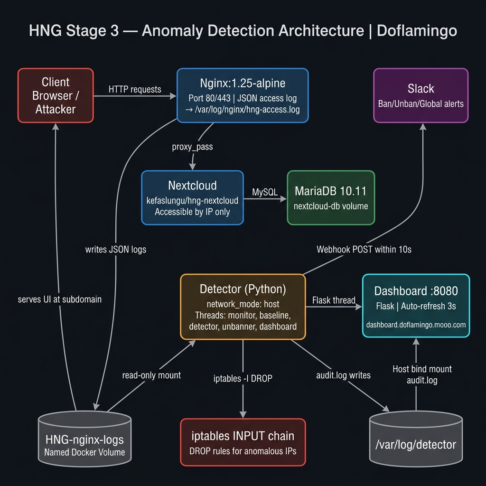

# HNG Stage 3 DevOps — Real-Time Anomaly Detection Engine

> **HNG Username:** Doflamingo | **GitHub:** [Collinsthegreat](https://github.com/Collinsthegreat/hng-stage3-devops)

---

## Project Overview

This project implements a production-grade, real-time DDoS and traffic-anomaly detection engine deployed alongside a Nextcloud instance. It continuously tails Nginx JSON access logs, maintains statistical baselines of normal traffic, and automatically bans anomalous IPs via iptables within **10 seconds** of detection — with no use of Fail2Ban or rate-limiting libraries.

**Key capabilities:**
- Deque-based sliding windows (per-IP + global) with per-second eviction
- 30-minute rolling baseline with per-hour slot preference
- Z-score ≥ 3.0 OR rate ≥ 5× baseline mean detection
- Error surge tightening (z-score threshold drops to 2.0)
- Auto-unban backoff: 10 min → 30 min → 2 hours → permanent
- Slack alerts for every ban, unban, and global anomaly
- Live auto-refresh dashboard served at the dashboard subdomain

---

## Architecture



```
Client ──► Nginx (port 80) ──► Nextcloud ──► MariaDB
                │
                └──► HNG-nginx-logs (named volume)
                               │
                               ▼
                         Detector (network_mode: host)
                          ├── monitor    → tails log
                          ├── baseline   → rolling mean/stddev
                          ├── detector   → z-score evaluation
                          ├── blocker    → iptables -I DROP
                          ├── unbanner   → iptables -D on expiry
                          ├── notifier   → Slack webhooks
                          └── dashboard  → Flask :8080
```

---

## Live Endpoints

| Resource | URL |
|----------|-----|
| **Nextcloud** | `http://[YOUR SERVER PUBLIC IP]/` |
| **Dashboard** | `http://dashboard.doflamingo.mooo.com/` |
| **Dashboard (IP path)** | `http://[YOUR SERVER PUBLIC IP]/dashboard` |
| **Metrics API** | `http://dashboard.doflamingo.mooo.com/api/metrics` |

---

## Language Choice — Python

Python was chosen for:
- **threading model** — Python's `threading` module is ideal for I/O-bound workloads like log tailing, sleep-based polling, and HTTP serving. Each module runs as an independent daemon thread with a single shared state dict.
- **rich stdlib** — `collections.deque`, `subprocess`, `signal`, `json`, `threading`, and `time` are all built-in. No heavyweight frameworks.
- **fast iteration** — config-driven via a single `config.yaml`; all thresholds changeable without touching Python.
- **iptables integration** — straightforward via `subprocess.run(["iptables", ...])` inside a `privileged` container with `network_mode: host`.

---

## How the Sliding Window Works

Each module maintains its own `deque` (double-ended queue) of **timestamps**:

```python
self.global_window = deque()        # global timestamps
self.ip_window = defaultdict(deque) # per-IP timestamps
```

**Eviction logic** (`_evict_old`):
```python
cutoff = now - window_size_seconds
while self.global_window and self.global_window[0] < cutoff:
    self.global_window.popleft()
```

Because timestamps are always appended to the right (newest) and stale entries are always at the left (oldest), `popleft()` is **O(1)**. The window size is **60 seconds**. On every log line *and* every 0.1-second idle tick, stale entries are evicted. The request rate is then:

```python
rate = len(deque) / window_size_seconds   # req/s
```

This is a true sliding window — not a per-minute counter. Every timestamp is individually tracked and expired exactly when it falls outside the 60-second boundary.

---

## How the Baseline Works

`BaselineEngine` maintains:

1. **Rolling deque** — every recorded `req_per_sec` sample from the last 30 minutes (1800 seconds).
2. **Per-hour slots** — `{hour_int: [req_per_sec, ...]}` accumulated since startup.

Every **60 seconds**, `_recalculate()` runs:

```python
# Prefer current hour's data if it has ≥ 30 samples
current_hour = datetime.datetime.now().hour
hour_values = self._hour_slots.get(current_hour, [])

if len(hour_values) >= min_samples:
    values = hour_values          # use hour-specific baseline
else:
    values = rolling_window_all   # fall back to 30-min window

# Apply floor to prevent division-by-zero on cold start
effective_mean   = max(mean(values),   floor_mean=1.0)
effective_stddev = max(stddev(values), floor_stddev=0.5)
```

The per-hour slot preference allows the baseline to adapt to **diurnal traffic patterns** (e.g., low traffic at 3 AM won't inflate the baseline used at 3 AM the next day).

---

## Detection Logic

### Z-score formula
```
z = (rate - baseline_mean) / baseline_stddev
```

A z-score of 3.0 means the observed rate is 3 standard deviations above the mean — statistically significant for nearly any traffic distribution.

**Analogy:** If your average daily commute is 30 minutes (mean) with a 5-minute variance (stddev), a 45-minute commute has z = (45-30)/5 = 3.0. Something unusual is happening.

### Decision logic (per-IP)
```python
anomaly = (zscore >= 3.0) OR (ip_rate >= 5 × baseline_mean)
```

The 5× multiplier catches extreme rate spikes that might not score high on z-score during cold start (when stddev is still at its floor value).

### Error surge tightening
If an IP's 4xx/5xx error rate exceeds `3× expected_error_rate`, the z-score threshold drops from **3.0 → 2.0**, making detection more aggressive for obviously malicious traffic patterns (credential stuffing, scanner probes, etc.).

---

## iptables Blocking

**How rules are added:**
```bash
# Check for duplicate first (Fix #5)
iptables -C INPUT -s <ip> -j DROP     # exit 0 = rule exists → skip
iptables -I INPUT 1 -s <ip> -j DROP   # insert at top of INPUT chain
```

`-I INPUT 1` inserts the rule at position 1 (top), so it is evaluated before any other rules — the DROP takes effect immediately for all subsequent packets from that IP.

**How rules are removed (unban):**
```bash
iptables -D INPUT -s <ip> -j DROP     # delete exact matching rule
```

The detector runs with `network_mode: host` + `privileged: true` + `cap_add: NET_ADMIN` so it shares the host's network namespace and has full iptables access.

---

## Setup From Scratch

### 1. Prerequisites (Ubuntu 22.04)
```bash
sudo apt update && sudo apt upgrade -y

# Install Docker
curl -fsSL https://get.docker.com | sudo sh
sudo usermod -aG docker $USER
newgrp docker

# Install Docker Compose v2
sudo apt install -y docker-compose-plugin

# Install iptables
sudo apt install -y iptables
```

### 2. Clone and configure
```bash
git clone https://github.com/Collinsthegreat/hng-stage3-devops.git
cd hng-stage3-devops

cp .env.example .env
nano .env   # Fill in: SERVER_IP, DASHBOARD_DOMAIN, all passwords, SLACK_WEBHOOK_URL
```

### 3. Create audit log directory on host
```bash
sudo mkdir -p /var/log/detector
sudo chmod 777 /var/log/detector
```

### 4. Build and start
```bash
docker compose up --build -d

# Verify all containers healthy
docker compose ps

# Watch detector logs live
docker compose logs -f detector
```

### 5. Verify
```bash
# Named volume exists
docker volume inspect HNG-nginx-logs

# JSON log writing
docker compose exec nginx tail -5 /var/log/nginx/hng-access.log

# Baseline computing
docker compose logs detector | grep "Baseline recalculated"

# Dashboard live
curl -si http://localhost:8080/api/metrics

# Audit log
cat /var/log/detector/audit.log

# Simulate attack (run from a test host)
for i in $(seq 1 200); do curl -s http://[YOUR SERVER PUBLIC IP]/ > /dev/null; done

# Verify ban fired
sudo iptables -L INPUT -n | grep DROP
```

---

## Required Screenshots

All screenshots are in [`screenshots/`](screenshots/):

| File | Contents |
|------|----------|
| `Tool-running.png` | `docker compose logs -f detector` — daemon live, processing log lines (monitor thread active, baseline recalculating) |
| `Ban-slack.png` | Slack ban alert with IP, condition, rate, baseline, duration, timestamp |
| `Unban-slack.png` | Slack unban alert with original condition, rate at ban, and unban timestamp |
| `Global-alert-slack.png` | Slack global anomaly alert with global rate and baseline |
| `Iptables-banned.png` | `sudo iptables -L INPUT -n` showing DROP rule for the banned IP |
| `Audit-log.png` | `/var/log/detector/audit.log` with BAN, UNBAN, and BASELINE_RECALC entries |
| `Baseline-graph.png` | Dashboard Chart.js graph showing effective_mean over time with at least two hourly slots at visibly different values |

---

## Blog Post

> [BLOG POST URL — to be added after publication]

*Published on [Hashnode/Dev.to/Medium]: A beginner-friendly walkthrough covering sliding windows, statistical baselines, z-score detection, and iptables blocking.*

---

## Repository

**GitHub:** https://github.com/Collinsthegreat/hng-stage3-devops

---

## Critical Rules Checklist

- [x] No Fail2Ban used
- [x] No rate-limiting libraries used
- [x] Sliding windows are deque-based with per-second eviction
- [x] `effective_mean` computed from real traffic (30-min rolling baseline)
- [x] Named volume is `HNG-nginx-logs` (exact case)
- [x] Nginx logs write to `/var/log/nginx/hng-access.log` in JSON format
- [x] Nginx forwards real client IP via `X-Real-IP` and `X-Forwarded-For`
- [x] Dashboard refreshes every 3 seconds
- [x] Dashboard accessible at `dashboard.doflamingo.mooo.com`
- [x] Nextcloud accessible by IP only
- [x] Ban + Slack alert fires within 10 seconds
- [x] Unban backoff: 10 min → 30 min → 2 hours → permanent
- [x] All thresholds in `config.yaml`
- [x] `.env` never committed (in `.gitignore`)
